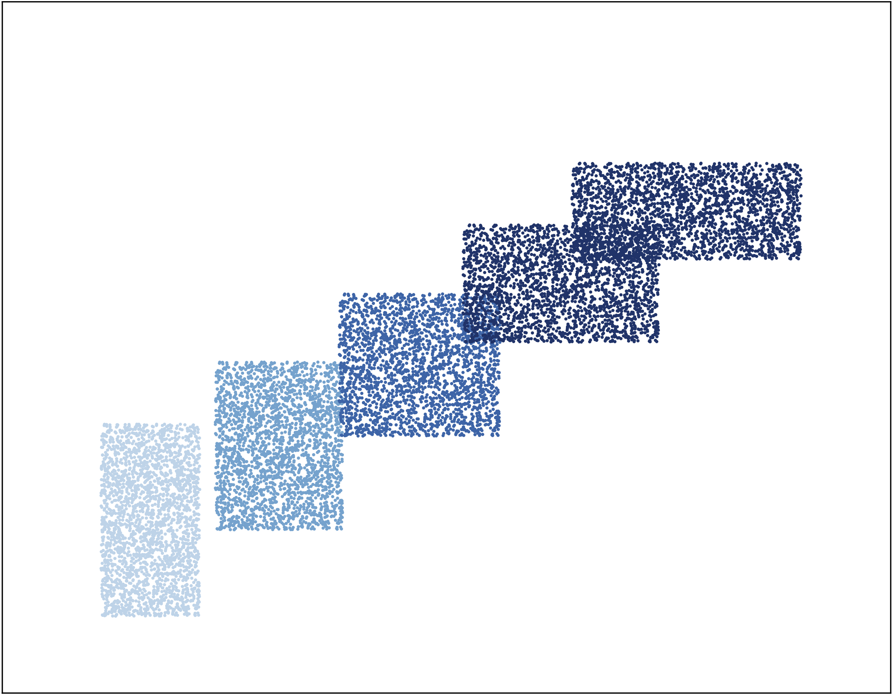

# SWOT-Flow : Sliced-Wasserstein Optimal Transport Flow

This repos is the official implementation of the paper **Learning Optimal Transport Between two Empirical Distributions with Normalizing Flows**


## Table of Contents

- [Install](#install)
- [Reproduction](#reproduction)

## Installation
Please make sure that you have python 3+ install in yout machine. First you will have to create a directory name SWOT-Flow:
```bash
mkdir SWOT-Flow
cd SWOT-Flow
```
Once use downloaded all the files from 4open.science and put them in the SWOT-Flow directory, you will have to install dependencies by:
```bash
pip install -r requirements.txt
```

## Reproduction

This section provides instructions on how to reproduce results from the paper.

All paths in the config file are relative to the current working directory (by default it is where you run `python ...`).

### Running the qualitative experiments

To run each of the qualitative experiments, use the following commands (taking the annulus and circles example):

```bash
python run_qualitative_experiment.py --data_type "circles"
```

The option `--data_type` determine which data you wan't to use to train your network, the available toy datasets are 'circles', 'blobs', 'triangles', 'rectangles', 'disks'.

2D plot results will be available in the **images** folder.

### Running the generalization experiments

To run each of the generalization experiments, use the following commands (taking the annulus and rectangles example):

```bash
python run_generalization_experiment.py --data_type "rectangles"
```

The option `--data_type` determine which data you wan't to use to train your network, the available toy datasets are 'circles', 'rectangles'.

2D plot results will be available in the **images** folder.

### Running the Gaussian experiments with varying dimensions

To run Gaussian experiments, use the following commands (taking the annulus and square example):

```bash
python run_gaussians_experiment.py
```

Results will be seen directly in the terminal.